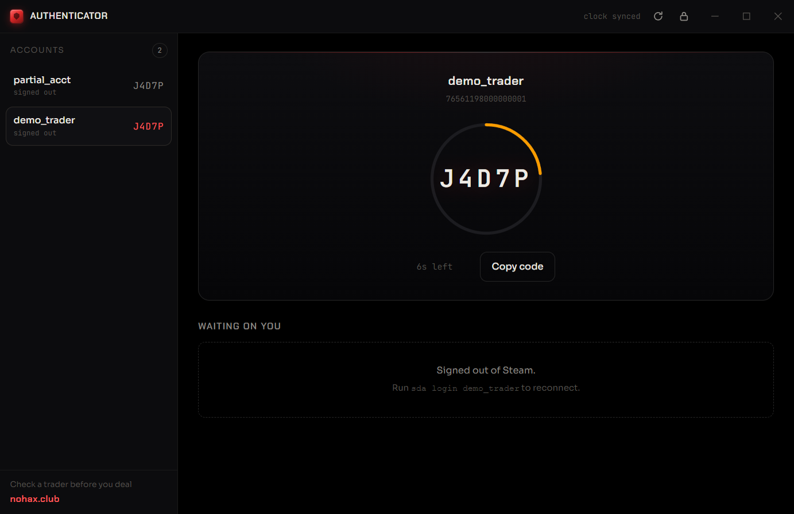
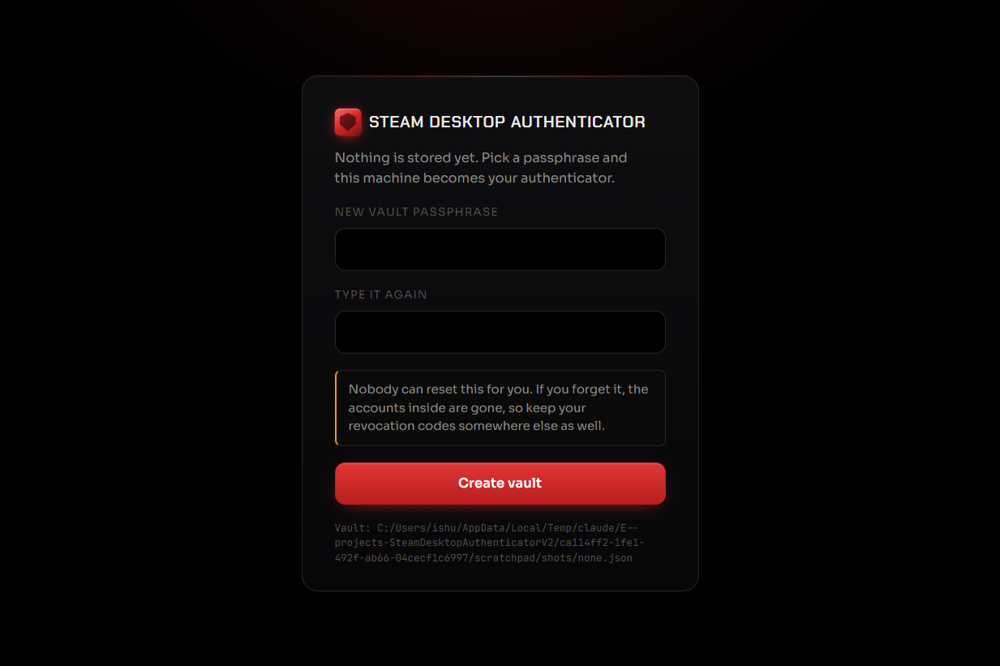
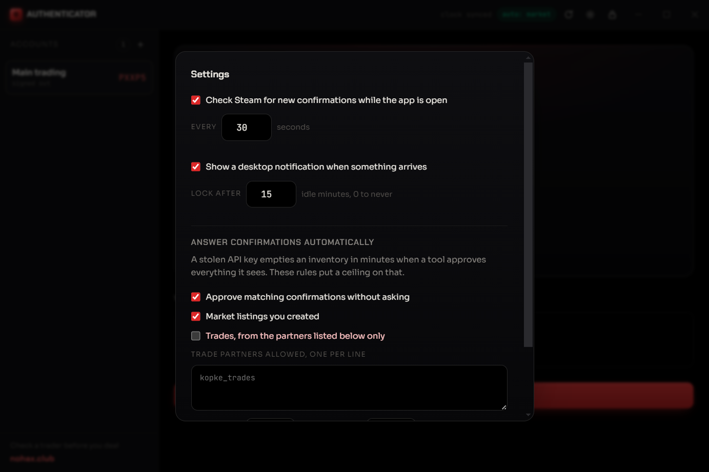
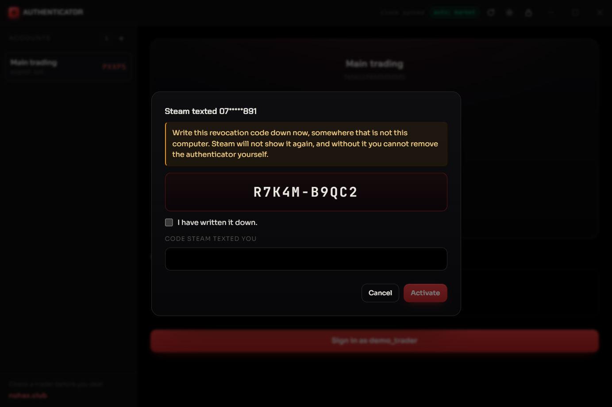
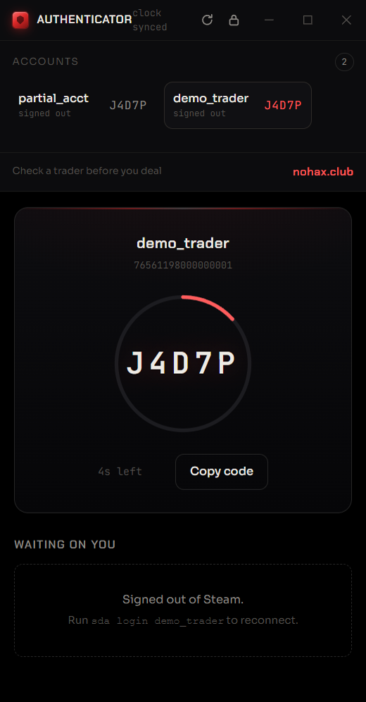

<div align="center">

# Steam Desktop Authenticator V2

**Steam Guard codes and trade confirmations, on a machine you own.**

[](https://github.com/idroid007/SteamDesktopAuthenticatorV2/actions/workflows/ci.yml)
[](LICENSE)
[](https://nodejs.org)
[](packages/core/package.json)

A successor to [Jessecar96/SteamDesktopAuthenticator](https://github.com/Jessecar96/SteamDesktopAuthenticator),
rebuilt in TypeScript for Windows, macOS and Linux.

Built by the people behind [nohax.club](https://nohax.club).

### [Download for Windows](https://github.com/idroid007/SteamDesktopAuthenticatorV2/releases/latest)

Portable build, no installation. Installer and Linux and macOS builds are on the
[releases page](https://github.com/idroid007/SteamDesktopAuthenticatorV2/releases).



</div>

---

## Your secrets stay on this computer

You create no account. We run no server. Nothing about you reaches us, because
there is no "us" anywhere in the data path. The app talks to Steam and to nothing else.

That claim is worth checking rather than believing, so:

- The core has **zero runtime dependencies**. The code you audit is the code that runs.
- Your vault is encrypted with scrypt and AES-256-GCM, and the key never leaves memory.
- Every release is built by CI and signed with npm provenance, which ties the published
  package to the exact commit and workflow run that produced it.
- `sda verify` checks your own install against the published checksums.

Fake SDA builds have been stealing Steam accounts since 2018. Asking you to trust a
download does nothing about that. Giving you a way to verify one does.

## What it does

| | |
|---|---|
| **Login codes** | The 5-character Steam Guard code, corrected against Steam's clock |
| **Trade confirmations** | Read, accept and deny trades and market listings |
| **Multiple accounts** | One vault, as many accounts as you trade with |
| **Import from SDA v1** | Point it at your `maFiles` folder and carry on |
| **Export** | Write an maFile back out whenever you want to leave |
| **Add or remove authenticators** | Link a new one, or unlink with your revocation code |
| **Local API** | Drive it from your own bots and scripts |

Every one of those has a button. You never need a terminal.

| | |
|---|---|
|  |  |
| **First run.** Pick a passphrase and the machine becomes your authenticator. | **Settings.** Automatic approval, with a ceiling on it. |
|  |  |
| **Adding an authenticator.** The revocation code is shown once, and Activate stays disabled until you say you wrote it down. | **On a phone.** The same interface, over your own network. |

## The white page, and why v2 exists

SDA v1 showed your confirmations by embedding a Chromium control and pointing it at
Steam's confirmation page. Steam later turned that page into a JSON endpoint. The
embed had nothing to render, so it drew a white box, and 42 issue threads piled up
behind it.

v2 reads the JSON and draws the list itself. No embedded browser, no Visual C++
redistributable, no white page.

The same rebuild picks up the rest of the backlog:

| SDA v1 | v2 |
|---|---|
| Windows only | Windows, macOS, Linux, and a phone through the web interface |
| Login broke and stayed broken | Steam's current token flow, with background renewal |
| PBKDF2-SHA1 at 50k rounds, AES-CBC with no MAC | scrypt and AES-256-GCM, tamper-detecting |
| One confirmation request at a time | Batched, so Steam stops rate limiting you |
| No scripting surface | A local HTTP API and an embeddable TypeScript library |

## Install

**Windows**: download the portable `.exe` from the
[releases page](https://github.com/idroid007/SteamDesktopAuthenticatorV2/releases/latest)
and run it. There is an installer there too, if you would rather have a Start menu entry.

**macOS and Linux**: grab the `.dmg`, `.AppImage` or `.deb` from the same page.

**From npm**, if you want the command line or the library:

```bash
npm install -g @sda/cli
```

## Using it

Open the app. It walks you through making a vault, then offers to import your existing
maFiles or create a new authenticator. Codes, confirmations, settings and account
management all live in the window.

The rest of this page is for people who want the terminal or the API.

## The command line

```bash
sda setup                      # create the encrypted vault
sda import ~/SDA/maFiles       # bring your accounts across
sda code                       # print the current code
sda confirm                    # review what is waiting
```

Some more:

```bash
sda code ishu_trades --watch   # live code with a countdown
sda code ishu_trades --copy    # straight to the clipboard
sda confirm --accept --all     # clear the queue
sda login ishu_trades          # sign in again when the session ages out
sda export ishu_trades         # write an maFile you can take elsewhere
sda serve                      # web interface and API
sda verify                     # check this install against its checksums
```

## Running it on your phone

Neither iOS nor Android runs Node, so nothing installs there. Run the daemon on a
machine you own and open it from the phone's browser:

```bash
sda serve --allow-lan --port 7749
```

The terminal prints a URL carrying a one-time token. The interface adapts to phone
width. Traffic on your network is plain HTTP, so keep this to a network you control,
and rotate the token when you are done.

Android also runs the CLI under [Termux](https://termux.dev), if you prefer that.

## The API

`sda serve` binds to `127.0.0.1` and requires a bearer token.

```
GET  /v1/state                              locked or unlocked
POST /v1/unlock                             {"passphrase": "..."}
POST /v1/lock                               drop the keys from memory
GET  /v1/accounts                           list accounts
GET  /v1/accounts/:id/code                  current Steam Guard code
GET  /v1/accounts/:id/confirmations         pending trades and listings
POST /v1/accounts/:id/confirmations/:cid    {"decision": "accept" | "deny"}
POST /v1/accounts/:id/confirmations/batch   answer many at once
GET  /v1/events                             server-sent stream of new confirmations
GET  /v1/time                               drift between this machine and Steam
```

```bash
curl -H "Authorization: Bearer $SDA_TOKEN" \
     http://127.0.0.1:7749/v1/accounts/76561198000000001/code
# {"code":"7K4MB","expiresIn":21,"generatedAt":1789127311}
```

**The API hands out codes, never secrets.** No endpoint returns your shared secret,
your identity secret or your revocation code. Somebody who takes your API token can
generate codes until you rotate it. They cannot walk off with your authenticator.

## As a library

```bash
npm install @sda/core
```

```ts
import { Account, parseMaFile, steamTime } from '@sda/core';

const account = new Account(parseMaFile(await readFile('trader.maFile', 'utf8')));

const { code, expiresIn } = await account.code();
console.log(`${code}, good for ${expiresIn}s`);

for (const confirmation of await account.confirmations()) {
  console.log(confirmation.kind, confirmation.headline);
}
```

Full reference in [packages/core/API.md](packages/core/API.md).

## Checking who you are trading with

A confirmation tells you a trade is waiting. It does not tell you whether the person
on the other side has a history of taking items and disappearing.

Trade confirmations in the app carry a link to that account's reputation page on
[nohax.club](https://nohax.club), which tracks ban history, trade holds and trust
signals for CS2 accounts. Click it before you accept a trade you are unsure about.

## Moving from SDA v1

```bash
sda import "C:\Program Files\Steam Desktop Authenticator\maFiles"
```

If SDA encrypted your maFiles, decrypt them in SDA first. It holds the only key.

Your revocation code matters more than anything else in that folder. Write it down
somewhere that is not this computer. Without it, losing the vault means losing the
account.

## Security

Read [SECURITY.md](SECURITY.md) for the threat model and how to report a problem.

Short version: this software puts your Steam authenticator on a general-purpose
computer. Malware on that computer can reach it, which is true of SDA v1, of
steamguard-cli, and of every tool in this category. Steam's own mobile app stays the
safer choice for an account you cannot afford to lose.

## Building it yourself

```bash
git clone https://github.com/idroid007/SteamDesktopAuthenticatorV2
cd SteamDesktopAuthenticatorV2
npm install
npm run build
npm test
```

| Package | What it is |
|---|---|
| `packages/core` | Protocol, crypto and storage. Zero runtime dependencies |
| `packages/cli` | The `sda` command and the local server |
| `packages/ui` | The web interface, plain TypeScript and CSS |
| `packages/desktop` | The Electron shell |

## Thanks

[Jesse Carruthers](https://github.com/Jessecar96) wrote the original and maintained it
for years. [geel9](https://github.com/geel9) wrote the SteamAuth library it stood on.
[Dyc3](https://github.com/dyc3) keeps steamguard-cli current and worked out plenty of
Steam's behaviour along the way. This project reads their work and owes them for it.

## License

MIT. See [LICENSE](LICENSE).

Chakra Petch, Sora and JetBrains Mono ship with the app under the SIL Open Font
License 1.1.
